
| Name           | NRP        | Kelas     |
| ---            | ---        | ----------|
| Farrel Aqilla Novianto | 5025241015 | Jarkom C |

## Put your topology config image here!

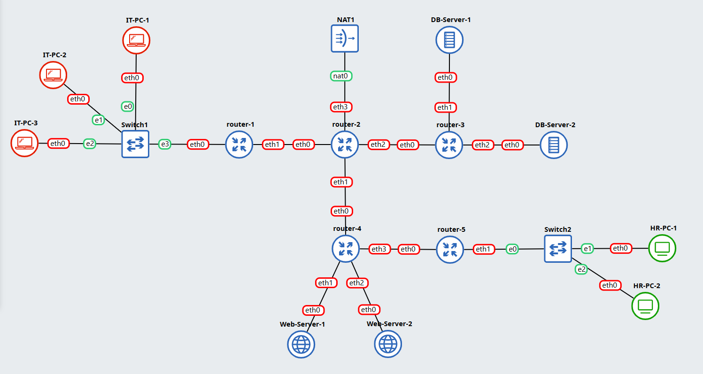

## Put your GNS3 Project file here!

[`Project and Config File`](https://drive.google.com/drive/folders/1FOmKinJx4m3HrW_-BP7ZbdZ_VHs9FzUR?usp=sharing)

 

## Soal 1

> Lakukan subnetting pada topologi diatas menggunakan metode VLSM: [Referensi](https://github.com/arsitektur-jaringan-komputer/Modul-Jarkom/tree/master/Modul-4/Subnetting#2-vlsm-variable-length-subnet-masking)  
*Cantumkan juga tabel dan diagram pembagian subnet pada laporan praktikum*.

> _Subnet the topology above using the VLSM method: [Reference](https://github.com/arsitektur-jaringan-komputer/Modul-Jarkom/tree/master/Modul-4/Subnetting#2-vlsm-variable-length-subnet-masking)_  
_Also include the subnet table and diagram in the lab report._

**Answer:**

- Screenshot

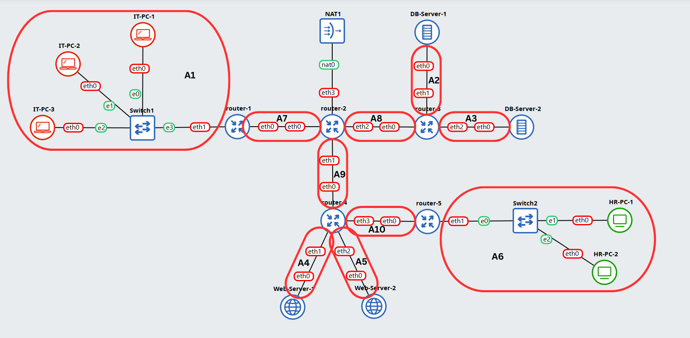
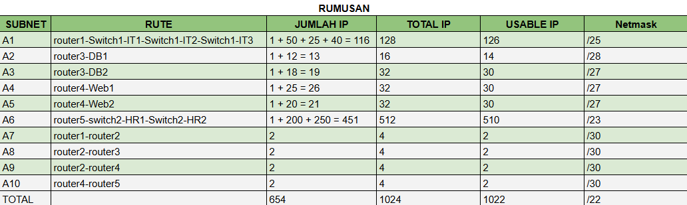
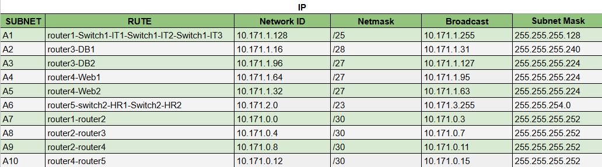
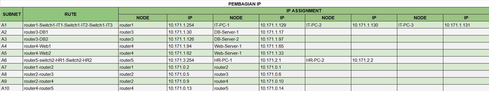

- Explanation

Saya menerapkan teknik subnetting Variable Length Subnet Mask (VLSM) pada blok supernet `10.171.0.0/22` untuk mengelola alokasi alamat IP secara efisien bagi total 654 host. Pembagian dilakukan secara hierarkis, dimulai dari subnet dengan kebutuhan host terbesar (descending) untuk mencegah tumpang tindih (overlapping) alamat. A6 (Subnet HR) sebagai segmen terbesar dialokasikan prefix /23 (510 usable IP), diikuti oleh A1 (Subnet IT) dengan prefix /25, serta segmen DB-Server (A2 dan A3) dan Web-Server (A4 dan A5) yang menggunakan variasi prefix /27 dan /28 sesuai beban layanan, antara server 1 dan 2 terpisah karena memiliki interface yang berbeda. Terakhir, subnet point-to-point antar router (A7, A8, A9, A10) dengan menggunakan prefix /30 yang membatasi alokasi hanya untuk 2 alamat IP per subnet.

 

## Soal 2

> Buatlah agar router-2 dapat melakukan koneksi ke internet. [Dapat menggunakan static routing].

> _Make sure router-2 can connect to the internet. [Can use static routing]._

**Answer:**

- Screenshot

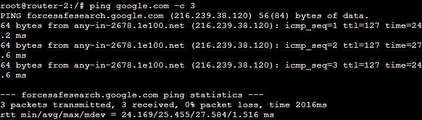

- Explanation

Untuk menghubungkan Router-2 ke internet, konfigurasi dilakukan dengan mengaktifkan DHCP Client pada interface `eth3` yang terhubung langsung ke NAT. Melalui mekanisme ini, router secara otomatis mendapatkan alokasi alamat IP dan jalur routing default tanpa perlu pengaturan manual. Bersamaan dengan itu, sistem secara otomatis menetapkan alamat `192.168.122.1` sebagai nameserver (DNS), yang merupakan alamat server penyedia layanan DHCP tersebut.

 

## Soal 3

> Setelah mengimplementasi subnetting, buatlah agar seluruh topologi dapat terhubung. Lakukan Dynamic Routing pada topologi tersebut.
*Pastikan seluruh node yang ada dapat mengakses internet*.

> _After implementing subnetting, ensure the entire topology is connected. Perform dynamic routing on the topology._  
_Ensure all existing nodes can access the internet._

**Answer:**

- Screenshot

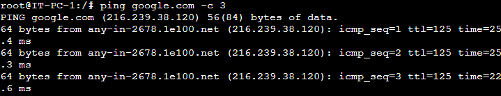
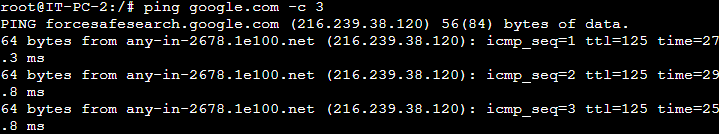
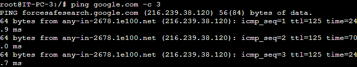

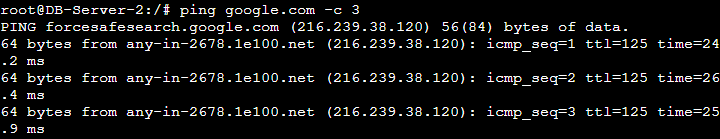
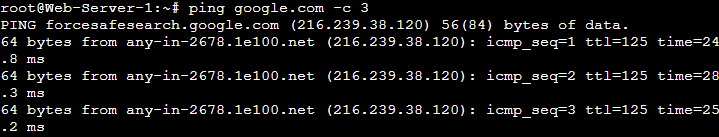

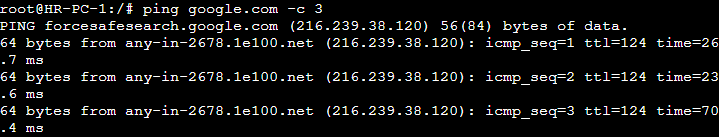
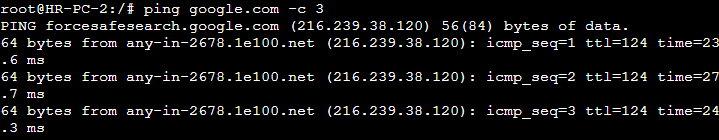

- Explanation

Untuk membuat jembatan koneksi untuk seluruh subnet, diterapkan mekanisme dynamic routing menggunakan protokol RIP (Routing Information Protocol) yang dijalankan melalui aplikasi FRR (Free Range Routing). Dalam konfigurasi ini, setiap router diinstruksikan untuk mengaktifkan service RIP dan secara otomatis mengiklankan jaringan yang terhubung langsung dengannya ke router tetangga. Penggunaan FRR memungkinkan pengelolaan routing yang fleksibel, di mana protokol RIP akan menyebarkan informasi tabel routing ke seluruh topologi secara dinamis tanpa perlu pengaturan manual yang rumit. Hasilnya seluruh subnet jaringan dari subnet IT, DB-Server, Web-Server, HR, dan antar router. Kini dapat saling berkomunikasi (ping) karena setiap router telah mengenali jalur menuju semua subnet yang ada secara otomatis.

 

## Soal 4

> Lakukan setup web server dengan file html di attachment berikut: [ Attachment ](https://drive.google.com/file/d/199qwfTNJCkxDV7mdO-MsaDdApkmKsnAG/view?usp=sharing)  menggunakan nginx pada “Web-Server-1” dan “Web-Server-2”.  
*Config dibebaskan kepada praktikkan dengan catatan menggunakan port 80*.

> _Set up a web server with the HTML file in the following attachment: [ Attachment ](https://drive.google.com/file/d/199qwfTNJCkxDV7mdO-MsaDdApkmKsnAG/view?usp=sharing) using nginx on “Web-Server-1” and “Web-Server-2”._
_Configuration is free to practice, but note that it uses port 80._

**Answer:**

- Screenshot

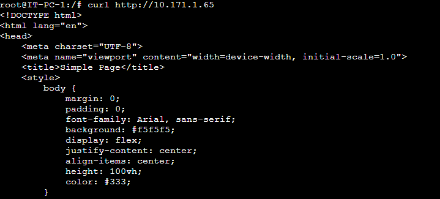

- Explanation

Implementasi layanan web dilakukan dengan menginstal `Nginx` pada `Web-Server-1` dan `Web-Server-2` sebagai webserver. File HTML yang disediakan dalam lampiran kemudian diunggah ke direktori root server (/var/www/ws1 atau ws2) dan diatur sebagai file indeks (index.html) agar dapat diakses secara otomatis. Dengan konfigurasi ini, kedua server dikondisikan untuk mendengarkan port 80 dan siap melayani permintaan HTTP dari klien. Keberhasilan setup diverifikasi melalui pengujian akses ke IP masing-masing server menggunakan `curl`, yang secara tidak langsung menampilkan konten halaman web sesuai dengan file yang telah dikonfigurasi.

 

## Soal 5

> Kalian diminta untuk melakukan drop semua paket TCP yang masuk  ke subnet HR dengan port 1337 dan 4444. Lakukan testing dengan netcat.

> _You are asked to drop all incoming TCP packets to the HR subnet with ports 1337 and 4444. Test with netcat._

**Answer:**

- Screenshot

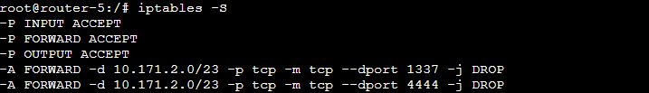
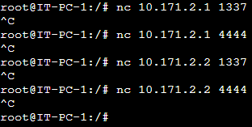

- Explanation

Konfigurasi packet filtering diterapkan langsung pada `router-5` yang berfungsi sebagai gerbang utama subnet HR. Aturan iptables ditambahkan secara spesifik pada chain `FORWARD` untuk mencegat lalu lintas data yang melintas menuju blok IP `10.171.2.0/23`. Perintah ini secara tegas menginstruksikan router untuk membuang (DROP) setiap paket TCP yang menargetkan port `1337` dan `4444` tanpa mengirimkan notifikasi balik ke pengirim. Aturan ini divalidasi melalui pengujian menggunakan `netcat` (nc), di mana upaya koneksi ke kedua port tersebut mengalami kegagalan (tidak ada respons) dengan tanda `^C` yang berarti tidak paket yang berhasil lalu saya force stop, membuktikan bahwa firewall telah berhasil memblokir jalur komunikasi spesifik tersebut sesuai instruksi.

 

## Soal 6

> Lakukan pembatasan sehingga koneksi SSH pada semua Web Server hanya dapat dilakukan oleh user yang berada pada node IT-PC-1, IT-PC-2, dan IT-PC-3. 

> _Implement restrictions so that SSH connections to all Web Servers can only be made by users on nodes IT-PC-1, IT-PC-2, and IT-PC-3._

**Answer:**

- Screenshot

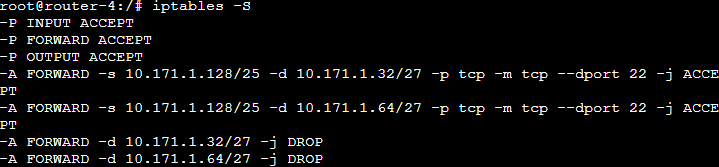
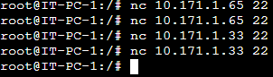
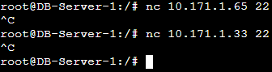

- Explanation

Konfigurasi packet filtering diterapkan langsung pada `router-4` yang berfungsi sebagai gerbang utama subnet Web-Server. Aturan disusun menggunakan mekanisme whitelist, di mana koneksi SSH (port 22) secara eksplisit diizinkan (ACCEPT) hanya jika paket berasal dari subnet IT `10.171.1.128/25` menuju subnet Web Server. Aturan berikutnya berfungsi sebagai penutup (deny-all) yang akan membuang (DROP) paket dari sumber lain yang mencoba mengakses subnet tersebut. Konfigurasi ini menjamin bahwa hak akses Web-Server via SSH bersifat eksklusif bagi node di subnet IT, sementara upaya koneksi dari subnet lain akan ditolak sepenuhnya oleh router demi keamanan.

 

## Soal 7

> Semua subnet hanya dapat mengakses semua DB-Server pada port 80 dan 443 (DB-Server-1 dan DB-Server-2) pada hari Senin-Sabtu, pukul 07:00- 22:00.

> _All subnets can only access all DB-Servers on ports 80 and 443 (DB-Server-1 and DB-Server-2) on Monday-Saturday, 07:00-22:00._

**Answer:**

- Screenshot

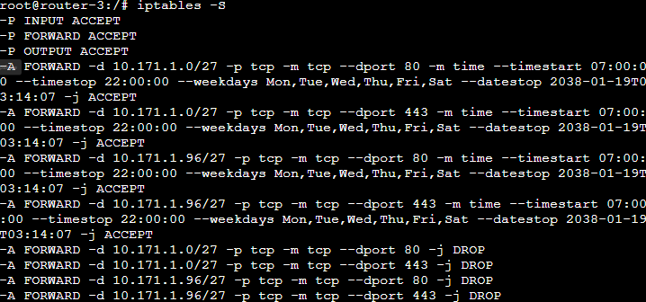
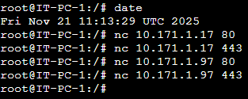

- Explanation

Konfigurasi packet filtering diterapkan langsung pada `router-3` yang berfungsi sebagai gerbang utama subnet DB-Server. Konfigurasi ini memanfaatkan modul time pada iptables untuk membuat jadwal spesifik, di mana lalu lintas TCP menuju port 80 dan 443 hanya diizinkan (ACCEPT) ke subnet DB-Server yaitu `10.171.1.17` dan `10.171.1.97` pada rentang waktu yang ditentukan, yaitu hari Senin hingga Sabtu pukul 07:00 s.d. 22:00. Mekanisme ini dilengkapi dengan aturan DROP di baris akhir yang berfungsi memblokir segala upaya koneksi ke port tersebut di luar waktu yang ditentukan (seperti malam hari diatas jam 10 malam atau hari Minggu), memastikan bahwa layanan database tertutup rapat dari akses eksternal saat tidak ada aktivitas.

 

## Soal 8

> Kemudian, buat agar “Web-Server-1” dan “Web-Server-2” hanya memperbolehkan traffic bertipe HTTP.

> _Then, make sure that “Web-Server-1” and “Web-Server-2” only allow HTTP type traffic._

**Answer:**

- Screenshot

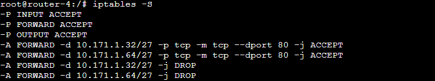
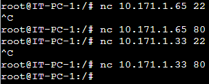

- Explanation

Konfigurasi packet filtering diterapkan langsung pada `router-4` yang berfungsi sebagai gerbang utama subnet Web-Server. Konfigurasi ini menggunakan whitelist, di mana aturan pertama secara eksplisit mengizinkan (ACCEPT) lalu lintas TCP port 80 (HTTP) menuju subnet Web-Server-1 dan Web-Server-2. Aturan tersebut kemudian dikunci dengan kebijakan menolak semua paket selain HTTP (DROP) untuk semua sisa paket yang menuju ke destinasi yang sama, sehingga secara efektif memblokir seluruh jenis lalu lintas lain (seperti UDP atau port TCP lainnya) dan memastikan server benar-benar terisolasi hanya untuk melayani permintaan web.

 

## Soal 9

> Pilih salah satu Subnet dan lakukan blokir terhadap semua request protokol ICMP (ping) dari luar subnet terhadap subnet tersebut.

> _Select one of the Subnets and block all ICMP protocol requests (ping) from outside the subnet to that subnet._

**Answer:**

- Screenshot

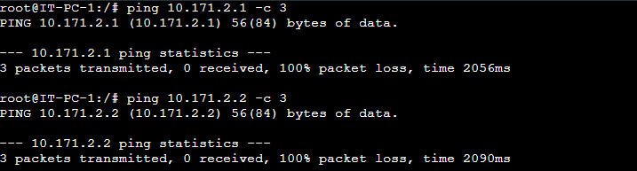
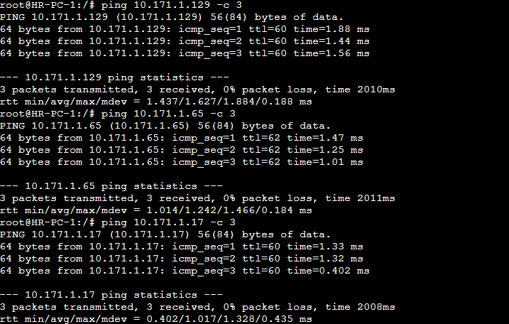

- Explanation

Saya memilih subnet HR. Konfigurasi firewall pada Router-5 ditambahkan untuk memblokir permintaan ICMP (ping) dari pihak eksternal namun tetap bisa PING keluar subnet. Mekanisme ini menerapkan filter selektif, di mana aturan awal secara eksplisit mengizinkan paket ICMP keluar dari subnet HR `10.171.2.0/23` serta menerima kembali paket balasannya `echo-reply`. Setelah jalur diamankan, aturan berikutnya membuang (DROP) segala inisiasi paket ICMP baru yang berasal dari luar subnet.

 

## Soal 10

> Konfigurasikan fitur logging untuk melakukan log terhadap seluruh paket yang di-DROP pada lalu lintas setiap node.

> _Configure the logging feature to log all dropped packets on each node's traffic._

**Answer:**

- Screenshot

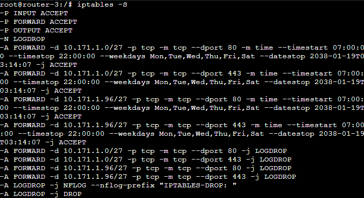
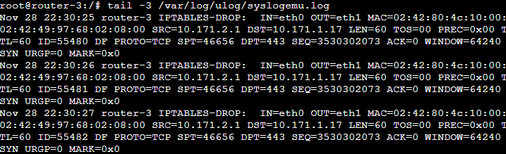
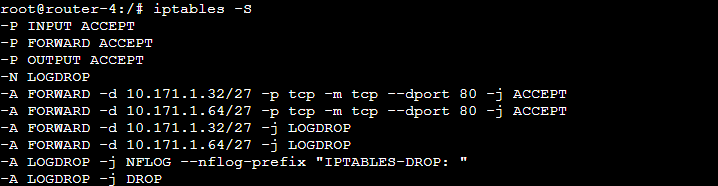
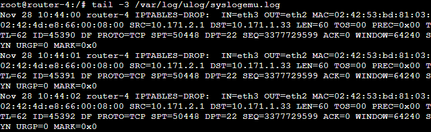
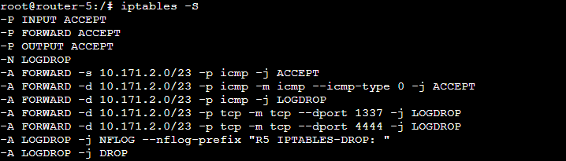
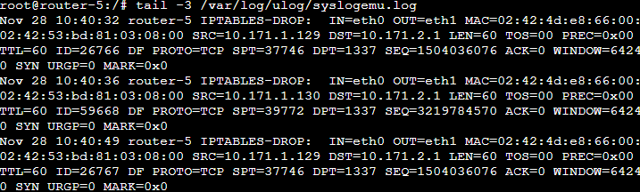

- Explanation

Mekanisme logging diimplementasikan dengan membuat custom chain baru bernama LOGDROP. Chain ini dirancang untuk menjalankan dua aksi berurutan, pertama, mencatat log, dan kedua, mengeksekusi aksi pembuangan (DROP) paket tersebut. Konfigurasi logging ini divalidasi menggunakan perintah iptables -nvL, yang menampilkan struktur aturan beserta penghitung paket (packet counters) untuk memastikan bahwa setiap upaya intrusi tidak hanya digagalkan, tetapi juga terekam secara sistematis dalam log sistem.

 
  
## Problems
Kesusahan mencari cara untuk membuat file .log sendiri, jadi saya memutuskan melihat log menggunakan syntax `iptables -nvL`

## Revisions (if any)
Menambahkan mekanisme logging menggunakan `ulogd2`
